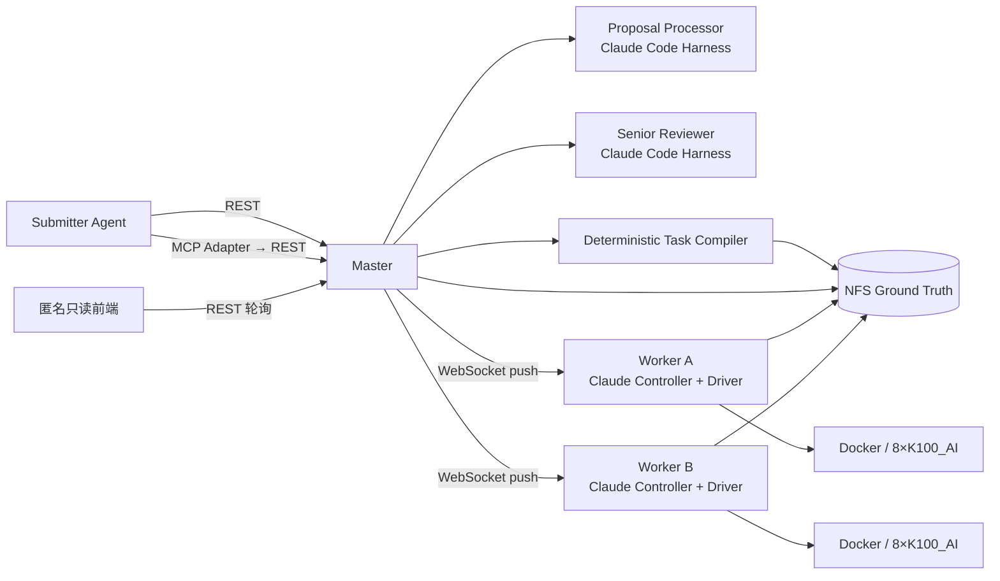
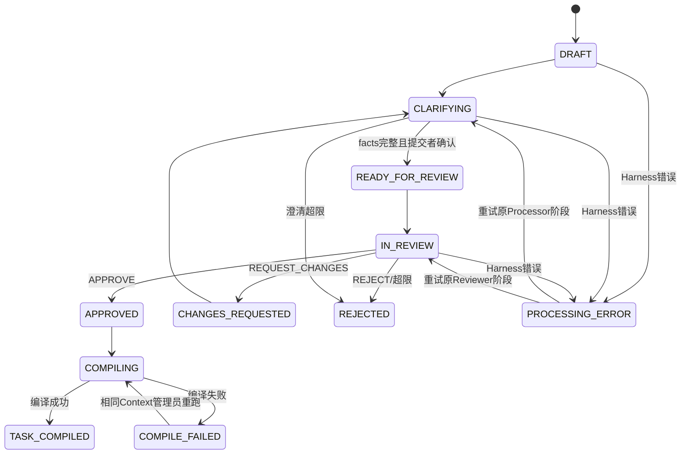
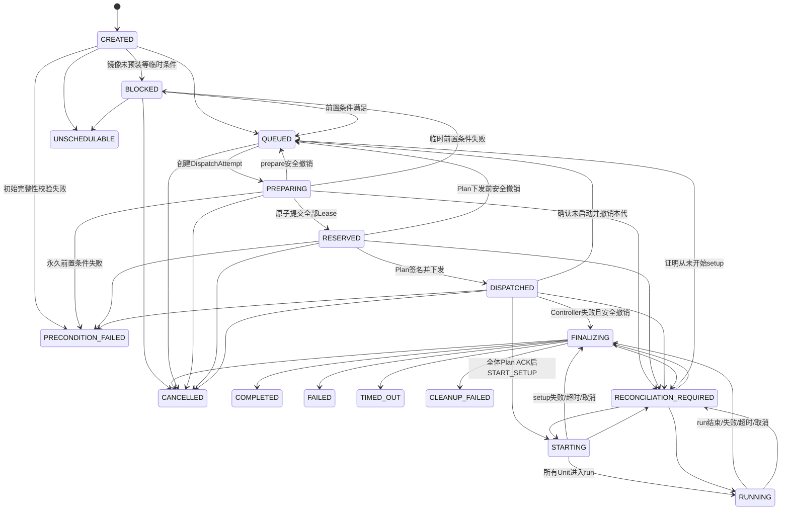

# Agent 驱动 GPU 任务调度框架详细规范

- 文档状态：已确认（MVP）
- 规范版本：0.1.0
- MVP 目标环境：2 个 Worker 节点、16 张 K100_AI
- 最后更新：2026-08-20
- 决策来源：[Agent Task Scheduler Grilling QA](./agent-task-scheduler-grilling-qa.md)

## 1. 规范约定

本文是 MVP 的权威产品与技术规范。

关键词 **MUST（必须）**、**MUST NOT（禁止）**、**SHOULD（应该）**、**SHOULD NOT（不应该）**、**MAY（可以）** 表示不同强度的实现约束。发生冲突时，按以下顺序解释：

1. MUST/MUST NOT 条款、状态转换表和 JSON Schema；
2. 失败处理矩阵；
3. API 与协议定义；
4. 时序图和示例；
5. 背景说明。

示例不创造正文没有规定的新能力。本文中的“Agent”如果没有进一步限定，指外部 Proposal Submitter Agent；Processor、Reviewer 和 Worker Controller 均使用全名。

## 2. 背景与问题

开发人员在无 GPU 的开发环境中完成代码开发，但测试必须在隔离的物理 GPU 节点上运行。传统人工分卡或固定队列存在以下问题：

- 多个开发人员或 Agent 争抢同一 GPU；
- 任务完成后容器、进程或显存状态不清晰；
- 资源申请、审核理由、启动命令和执行结果无法形成完整谱系；
- 开发环境可能通过随意设置可见设备变量直接占用 GPU；
- 多机任务缺少原子资源分配和统一失败语义。

本系统建立如下自动化闭环：

```text
Submitter Agent 提交 Proposal
  → Proposal Processor 多轮澄清
  → Submitter Agent 确认最终 revision
  → Senior Reviewer 审核
  → 确定性 Task Compiler
  → Scheduler 原子分配资源
  → Worker 执行 Docker 生命周期
  → 停止、清理、记录结果
```

## 3. 目标与非目标

### 3.1 MVP 目标

MVP MUST：

1. 接受相对宽松但标题固定的 Markdown Proposal；
2. 通过 Processor 与提交 Agent 自动完成多轮澄清；
3. 通过独立 Reviewer 自动审核，无正常路径上的人工批准；
4. 将已批准 revision 确定性编译为严格、不可变的 Task JSON；
5. 在两台 K100_AI Worker 上调度单机或双机 GPU 任务；
6. 使用 Docker CLI 创建或复用容器，执行 Bash/结构化命令；
7. 对双机任务实施 gang scheduling 和统一失败处理；
8. 在所有执行终态按容器模式执行 stop、必要时kill、新建容器rm的清理协议；
9. 将 Proposal、对话、审核、Task、执行和资源事件永久关联并可追溯；
10. 提供匿名只读前端展示系统全局状态。

### 3.2 MVP 非目标

MVP 明确不包含：

- 多租户安全隔离或抗恶意工作负载沙箱；
- 代码托管、镜像构建、自动拉取镜像；
- Secret 管理和秘密注入；
- 业务产物托管、内容解析或指标评估；
- Kubernetes、Slurm 或其他外部调度底座；
- Master 高可用、主从切换、多副本；
- Master/Worker/宿主机崩溃后的自动恢复；
- 网络分区下的一致性保证；
- 自动重试、checkpoint、断点续跑或单个 TaskUnit 重试；
- 非 K100_AI、显存切分、跨越两个节点或超过 16 卡；
- Notebook、交互式 Shell、SSH、常驻服务；
- 前端登录、角色权限和管理员写操作；
- Prometheus、自动告警和复杂资源预测；
- CPU/内存装箱调度；
- NFS 故障恢复；
- 预建容器被人工删除或改变后的自动修复；
- 已签名 Task/Execution Plan 被人工修改后的自动修复。

## 4. 信任模型和已知风险

### 4.1 信任假设

MVP 面向可信内部团队。系统假设：

- REST/MCP 调用方处于可信内网；
- username、提交 Agent、管理员和任务命令总体可信；
- NFS 始终正确挂载、可读写并提供预期 POSIX 语义；
- 已批准的预建容器不会被人工删除或改变基线；
- Task 和 Execution Plan 文件不会被人工编辑；
- K100_AI 设备编号在节点生命周期内稳定；
- 镜像已由管理员预装并验证。

### 4.2 身份不是认证

提交者API请求 MUST 声明`username`，Master MUST 仅接受本地YAML白名单中存在的username；匿名`/api/v1/observe/*` GET明确豁免。MVP不使用API Token，也不验证username的实际持有人。

因此：

- username 是责任标记，不是真实认证主体；
- 任何能访问可信内网 API 的调用方都可能冒用白名单 username；
- 审计记录只能说明请求声明了哪个 username；
- 前端可匿名查看全部非秘密数据。

### 4.3 容器权限

新建容器默认 MUST 使用：

- root 用户；
- privileged 模式；
- host network；
- Proposal 明确声明的宿主机挂载；
- Worker 注入的 `HIP_VISIBLE_DEVICES`。

容器 MUST NOT 挂载 `/var/run/docker.sock`。即便如此，privileged、root、host network 和宿主写挂载仍可能破坏或接管节点。本系统不把 Reviewer 的自然语言检查视为安全控制。

`HIP_VISIBLE_DEVICES` 只提供协作式设备选择。可信命令仍可能改写变量或尝试访问其他设备；MVP 不承诺强制 GPU 隔离。

## 5. 总体架构



### 5.1 固定部署拓扑

MVP 部署 MUST 固定为：

- 节点 A：Master、Worker A、8 张 K100_AI；
- 节点 B：Worker B、8 张 K100_AI；
- 节点 A 和 B 均挂载 `/public/share` NFS；
- 框架状态根目录默认为 `/public/share/agent-scheduler`；
- 两个 Worker 主动建立到 Master 的 WSS 连接；
- Master 通过已经建立的连接主动推送 assignment；
- Master 和 Worker 使用 Python 3.10；
- Master REST与WebSocket使用FastAPI，数据契约使用Pydantic/JSON Schema，前端使用简单HTML/JavaScript；
- 两节点UTC时钟由NTP同步，偏差不超过配置阈值；运行期超时仍以各进程本地单调时钟执行；
- Worker 由管理员以 root 手动启动。

MVP MUST 只有一个 Master 进程。默认监听端口冲突是同机误启第二实例的最小防护；跨主机双 Master 不在范围内。

## 6. 组件职责

### 6.1 Master

Master MUST 负责：

- REST API、只读前端 API 和 Worker WebSocket；
- username、镜像、容器和 Worker 配置读取；
- Proposal/Review/Task 状态机；
- HarnessAdapter 调用和并发控制；
- Task 编译、canonicalization、hash 和签名；
- 队列、aging、gang reservation、GPU/container/port Lease；
- Worker assignment、ACK、心跳和事件去重；
- NFS 单写入队列、快照和审计事件；
- Graceful shutdown 和 reconciliation。

Master MUST NOT 直接在 GPU 节点执行用户命令。

### 6.2 Proposal Processor

Processor MUST：

- 读取当前完整 Proposal、ProposalFacts、未决问题和最新消息；
- 使用只读 MCP 工具查询资源、镜像、容器和历史；
- 向提交 Agent提出问题；
- 每轮生成完整的新 Markdown revision；
- 生成符合 Schema 的 ProposalFacts；
- 明确列出缺失信息；
- 只在信息完整时设置 `ready_for_review=true`。

Processor MUST NOT 批准 Proposal、执行 Docker、改变白名单或隐藏已确认事实。

### 6.3 Senior Reviewer

Reviewer MUST 在独立 Harness会话中审核已确认 revision。它可以使用模型自由判断，但输出 MUST 符合 Reviewer JSON Schema，且只能返回：

- `APPROVE`；
- `REQUEST_CHANGES`；
- `REJECT`。

Reviewer MUST NOT 修改 Proposal。确定性 Validator 的硬约束失败时，Reviewer MUST NOT 绕过。

### 6.4 Task Compiler

Task Compiler MUST 是纯确定性程序。输入为：

- 已批准的 `proposal_revision_id`；
- 已校验的 ProposalFacts；
- `review_id`；
- Policy Snapshot；
- Schema 版本；
- 持久化的 Compilation Context，其中包含一次性分配后冻结的 `task_id`、`execution_id` 和 `created_at`。

Master MUST 在首次编译前生成并落盘 Compilation Context；同一已批准 revision 的编译重跑 MUST 复用该 Context，不得重新分配 ID 或时间。Compiler MUST 产生 canonical Task JSON；相同完整输入 MUST 产生逐字节相同的未签名内容和相同内容哈希。不同 Proposal 即使执行语义相同，也可以因对象 ID 不同而具有不同封装；其可执行字段 MUST 相同。LLM输出 MUST NOT 直接成为 Task。

### 6.5 Scheduler

Scheduler MUST 管理逻辑 Lease、实际 GPU 健康、队列 aging、原子资源预留、Execution Plan 和 assignment。

### 6.6 Worker

Worker 分为三层：

```text
WebSocket Client
  → Execution Controller（claude 或 deterministic）
  → Deterministic Python Driver
```

MVP 默认 `controller_mode: claude`。Controller 只可调用受限生命周期 MCP 工具；Driver拥有状态机、Docker命令、超时、日志和清理的最终控制权。

Worker在任务之间没有业务状态，也不建立本地数据库或持久 journal。执行期间允许持有内存状态。Framework日志直接写 NFS；WebSocket断线时小型状态事件暂存在内存。

`execute_assignment(assignment_id, dispatch_generation)` MUST 是幂等且快速返回的所有权移交操作：它只负责原子创建或确认已经存在的 Python supervisor，并返回 `supervisor_handle`，不得等待业务任务结束。supervisor一旦接管，生命周期 MUST 独立于Claude Code进程；Controller退出、超时或同参数重试 MUST NOT停止或重复启动Task。

只有在supervisor尚未接管前发生的Controller错误才能产生Task失败原因`WORKER_AGENT_ERROR`。若此时尚未提交`START_SETUP`，Master MUST 对全gang执行PRE_START_ABORT；证明全部Unit未启动并释放本地锁后进入`FINALIZING → FAILED`，证明不完整则进入`RECONCILIATION_REQUIRED`。若`START_SETUP`已经提交，则所有已启动容器按强制路径清理并进入`FINALIZING → FAILED`。不得把Worker Controller失败写成Proposal的`PROCESSING_ERROR`。

Worker收到业务终态后，在对应terminal event得到Master持久化ACK前 MUST 将assignment保持为`REPORTING_TERMINAL`，不得把自己视为完全空闲，也 MUST 拒绝Graceful shutdown。这样无需本地持久journal，仍可保证Master正常停机期间完成的终态在重连后被补报。

### 6.7 HarnessAdapter

跨 harness 的权威抽象 MUST 是程序接口，不是 Skill：

```text
invoke(role, context_packet, tool_config, output_schema, timeout)
  -> structured_output + raw_events + command_record
```

MVP 实现 Claude Code Adapter；未来的 dsh、Codex Adapter MUST 通过同一契约测试。差异只能位于进程启动、认证和事件解析层。

## 7. Claude Code Harness

MVP SHOULD 使用等价于以下行为的非交互调用：

```text
claude --print --bare --no-session-persistence \
  --output-format stream-json \
  --json-schema <role-schema> \
  --strict-mcp-config \
  --system-prompt <versioned-prompt>
```

实现 MUST：

- 每次调用启动独立进程；
- 不使用 `--resume` 或本地会话作为事实来源；
- 禁用 Bash/Edit 等非授权内置工具；
- 不使用 `--dangerously-skip-permissions`；
- 只开放角色所需 MCP 工具；
- 保存脱敏后的实际命令、工作目录、输入、输出、工具事件、开始结束时间和退出码；
- 不要求保存 Claude Code版本号；
- 不在框架中管理具体 temperature、token预算或模型参数；
- Processor/Reviewer调用墙钟超时 10 分钟；
- Worker Controller编排调用墙钟超时 5 分钟；
- Schema错误、限流或调用超时最多自动重试 3 次，短退避；
- Master默认最多并行运行 4 个 Harness进程；
- 同一 Proposal上的 Processor/Reviewer调用严格串行。

Claude Code认证由部署管理员预先配置，不属于框架职责。

### 7.1 Context Packet

每轮调用 SHOULD 将稳定内容放在前部、动态内容放在后部。Context Packet MUST 内联：

- 角色 System Prompt和输出 Schema引用；
- 当前完整 Proposal revision；
- 当前 ProposalFacts；
- 未决问题；
- 最新提交者回复；
- 最近一次 Reviewer findings（如有）。

全部旧消息和旧 revision不默认全量内联。Harness可通过以下只读工具获取：

- `get_messages`；
- `get_revision`；
- `diff_revisions`；
- `get_review`；
- `search_proposal_history`。

系统 MAY 维护确定性 `decision_ledger.json` 作为索引，但原始消息、revision和审核记录始终是 Ground Truth。

## 8. 领域模型

### 8.1 核心对象

| 对象 | 含义 | 可变性 |
|---|---|---|
| User | 白名单中的 username | 配置可新增/修改 |
| Proposal | 一次提案协商的根对象 | 当前状态可变 |
| Message | Processor、Reviewer或提交 Agent消息 | 追加后不可变 |
| ProposalRevision | 某一轮完整 Markdown | 不可变 |
| ProposalFacts | revision的规范化事实 | 与 revision绑定、不可变 |
| Review | 对一个 revision的结构化审核 | 不可变 |
| Task | 一个已批准 Proposal编译出的逻辑任务 | 不可变、签名 |
| TaskUnit | Task内一个节点执行单元 | 不可变 |
| Execution | Task唯一一次实际执行 | 不可变身份 |
| DispatchAttempt | execution开始setup前的一次调度尝试 | generation递增，历史不可变 |
| ExecutionPlan | 某个DispatchAttempt的Worker/GPU/端口/rank分配 | 不可变、签名 |
| Assignment | 某个DispatchAttempt中下发给一个Worker的Unit | 生命周期可变 |
| Lease | GPU、容器和端口的逻辑占用 | 状态可变 |
| AuditEvent | 所有行为的审计事件 | append-only |

所有ID MUST使用带类型前缀的UUIDv7，例如`prop_`、`rev_`、`review_`、`task_`、`unit_`、`exec_`、`dispatch_`、`plan_`、`assign_`、`lease_`、`msg_`、`evt_`。

所有持久化时间 MUST 使用 UTC RFC 3339。超时计算 MUST 使用单调时钟。

### 8.2 Proposal 与 Task 的基数

- 一个 Proposal包含多个 revision和 review；
- 一个已批准 Proposal revision最多产生一个有效 Task；
- 一个 Task包含 1 或 2 个 TaskUnit；
- 一个 Task只有一个 execution_id；
- 一个Execution在任何setup开始前 MAY产生多个按`dispatch_generation`递增的DispatchAttempt；
- 每个DispatchAttempt恰好有一个不可变Execution Plan，Plan内每个TaskUnit恰好对应一个assignment；
- 被安全撤销且从未开始setup的Attempt标记`ABORTED_BEFORE_START`，不属于业务重试；
- 任一Unit开始setup后 MUST 禁止创建新的DispatchAttempt；
- MVP不在同一 Task上创建第二 execution；
- 重试必须创建带 `retry_of_task_id` 或 `supersedes_proposal_id` 的新 Proposal。

## 9. Proposal 契约

### 9.1 Markdown 模板

初始 Proposal MUST 包含所有固定标题，未知内容 MAY 写 `TBD`：

```markdown
# Proposal

## Identity
## Objective
## Success Criteria
## Workload and Code
## Container
## Resources
## Commands
## Inputs and Mounts
## Environment
## Networking and Privileges
## Timeout and Cleanup
## Framework Logs
## Business Logs and Outputs
## Multi-node Coordination
## Risks and Notes
```

正文完全自由。交给 Reviewer前 MUST 不含 `TBD`。单机任务的多机章节 MUST 明确写 `Not applicable`。

Identity中的 username只用于可读性，Master MUST 用请求声明且白名单通过的 username覆盖或验证。

### 9.2 初始输入限制

- 初始 Markdown最大 256 KiB；
- 单条回复最大 256 KiB；
- MVP不支持附件上传；
- 大文件、代码、日志和数据 MUST 通过路径或引用表达；
- username MUST 匹配 `[a-zA-Z0-9._-]{1,64}`。

### 9.3 ProposalFacts 最小结构

ProposalFacts MUST 至少覆盖：

```json
{
  "schema_version": "1.0",
  "proposal_id": "prop_...",
  "revision_id": "rev_...",
  "username": "alice",
  "objective": "...",
  "success_criteria": ["..."],
  "resource_type": "K100_AI",
  "task_units": [
    {
      "role": "single|rank0|rank1",
      "gpu_count": 1,
      "required_worker_id": null,
      "container_mode": "create|reuse",
      "image_repository": "registry/team/image",
      "image_digest": "sha256:...",
      "container_name": null,
      "working_directory": "/workspace",
      "mounts": [],
      "environment": {},
      "setup": [],
      "run": {},
      "teardown": [],
      "business_logs": [],
      "outputs": []
    }
  ],
  "task_timeout_seconds": 3600,
  "network_mode": "host",
  "privileged": true,
  "container_user": "root",
  "risks": []
}
```

Processor负责语义完整性判断；Master在送审前 MUST 使用 ProposalFacts Schema进行结构校验。若 Processor误判完整但 Schema缺字段，Proposal MUST 回到 `CLARIFYING`，不进入 Reviewer。

### 9.4 多轮流程与限制



上图只画主干。以下转换表同样是权威约束：

| 当前状态 | 事件 | 下一状态 | 约束 |
|---|---|---|---|
| `APPROVED` | 创建并冻结Compilation Context | `COMPILING` | Context先落盘 |
| `COMPILING` | 编译成功 | `TASK_COMPILED` | 只允许一个有效Task |
| `COMPILING` | 编译失败 | `COMPILE_FAILED` | 保存编译尝试和错误 |
| `COMPILE_FAILED` | 管理员重跑 | `COMPILING` | MUST复用同一Context |
| `PROCESSING_ERROR` | 重试 | `resume_state` | `resume_state`必须是出错前阶段 |
| 任意非终态 | 提交者取消 | `CANCELLED` | 正在运行的Harness必须终止，迟到输出丢弃 |
| 任意非终态 | Proposal总期限到达 | `EXPIRED` | Master不可用期间墙钟仍继续 |
| `CLARIFYING` | 当前回复等待30分钟 | `EXPIRED` | 仅等待提交者时适用 |

`TASK_COMPILED`、`REJECTED`、`EXPIRED`、`CANCELLED`为终态。`COMPILE_FAILED`和`PROCESSING_ERROR`为可恢复暂停状态，不是终态。

规则：

- 一个往返 = Processor一条消息 + 提交 Agent一条有效回复；
- 最多 8 个往返，包含 Reviewer打回后的协商；
- Reviewer最多审核 4 次，即首次加最多 3 次 `REQUEST_CHANGES`；
- 每轮等待提交 Agent回复最多 30 分钟；
- Processor处理和 Harness重试耗时不计入 30 分钟；
- Proposal总生命周期最多 7 天；
- 每次有效回复重置当前轮30分钟计时；
- 每轮 MUST 产生完整 revision；
- 送审前提交 Agent MUST 调用 `confirm_revision(revision_id)`；
- Reviewer打回后产生的新 revision MUST 再次确认；
- 取消正在运行的Processor/Reviewer时，Master MUST 先落盘取消请求、终止Harness进程并丢弃尚未落盘的输出；
- `REJECTED`、`EXPIRED`、`CANCELLED`均不可恢复。

### 9.5 Reviewer 输出

Reviewer输出 MUST 至少包含：

```json
{
  "schema_version": "1.0",
  "review_id": "review_...",
  "reviewed_revision_id": "rev_...",
  "decision": "APPROVE|REQUEST_CHANGES|REJECT",
  "summary": "...",
  "findings": [],
  "required_changes": [],
  "risk_notes": [],
  "prompt_hash": "sha256:...",
  "command_record_id": "..."
}
```

非 K100_AI、单 Unit超过8卡、总数超过16卡、超过2个Unit、镜像不在白名单等硬错误 MUST 由确定性 Validator先阻止。提交者坚持不支持的要求时，Reviewer MUST `REJECT`。

## 10. Task 契约

### 10.1 Task 顶层结构

Task MUST 使用严格 JSON Schema，并包含完整字段，即使某字段值为 `null`：

```json
{
  "schema_version": "1.0",
  "task_id": "task_...",
  "proposal_id": "prop_...",
  "proposal_revision_id": "rev_...",
  "review_id": "review_...",
  "username": "alice",
  "lineage": {
    "retry_of_task_id": null,
    "supersedes_proposal_id": null
  },
  "created_at": "2026-08-20T00:00:00Z",
  "metadata": {
    "objective": "...",
    "success_criteria": ["..."]
  },
  "resource_type": "K100_AI",
  "execution_id": "exec_...",
  "units": [],
  "scheduling": {
    "initial_class": "NORMAL",
    "aged_after_seconds": 3600,
    "gang": false
  },
  "timeout": {
    "total_seconds": 3600,
    "setup_command_seconds": 600,
    "teardown_command_seconds": 300,
    "container_start_seconds": 60,
    "docker_stop_grace_seconds": 30,
    "docker_kill_seconds": 60,
    "docker_remove_seconds": 60,
    "gang_start_seconds": 60
  },
  "logging": {
    "framework_retention_days": 30
  },
  "policy_snapshot": {},
  "content_hash": "sha256:...",
  "signature": {
    "algorithm": "Ed25519",
    "key_id": "master-key-1",
    "value": "base64..."
  }
}
```

`metadata.objective` 和 `success_criteria`只用于审核与展示。Worker MUST NOT 根据自然语言改变执行。

首次任务的`lineage`两字段均为`null`。提交Agent为业务重试创建关联新Proposal时，至少填写一个关联字段；Compiler MUST 把已校验的关联关系原样写入新Task，但不得因此复用旧Task的execution或assignment。

### 10.2 TaskUnit

每个 TaskUnit MUST 包含：

```json
{
  "unit_id": "unit_...",
  "role": "single|rank0|rank1",
  "gpu_count": 1,
  "worker_constraints": {
    "required_worker_id": null
  },
  "container": {
    "mode": "create|reuse",
    "name": null,
    "privileged": true,
    "network_mode": "host",
    "user": "root",
    "mount_docker_socket": false,
    "cpu_limit": null,
    "memory_limit": null,
    "shared_memory_size": null
  },
  "image": {
    "repository": "registry/team/image",
    "digest": "sha256:..."
  },
  "mounts": [
    {
      "source": "/public/share/team-a",
      "target": "/workspace/shared",
      "read_only": false
    }
  ],
  "working_directory": "/workspace",
  "environment": {},
  "commands": {
    "setup": [],
    "run": {},
    "teardown": []
  },
  "business_logs": [
    {
      "host_path": "/public/share/team-a/logs/task_.../unit_.../train.log",
      "container_path": "/workspace/shared/logs/train.log",
      "required": true
    }
  ],
  "outputs": [
    {
      "host_path": "/public/share/team-a/outputs/task_.../unit_.../model.bin",
      "required": true
    }
  ]
}
```

约束：

- `units`长度 MUST 为1或2；
- 每个 `gpu_count` MUST 为1–8；
- 总卡数 MUST 不超过16；
- 两个Unit MUST 位于不同Worker；
- `resource_type` MUST 完整写为 `K100_AI`；
- `cpu_limit`、`memory_limit`在MVP中 MUST 为 `null`；
- `HIP_VISIBLE_DEVICES`和保留运行期变量 MUST NOT 出现在用户环境变量中；
- Proposal、Task、命令和环境变量 MUST NOT 包含密码、Token、私钥或其他Secret；MVP不自动扫描或脱敏，提交者与Reviewer负责遵守；
- 业务日志宿主路径规范化后 MUST 位于 `/public/share/`；
- 日志/输出路径 SHOULD 包含 task_id和unit_id，禁止并发覆盖。

### 10.3 命令联合类型

结构化命令：

```json
{
  "kind": "exec",
  "executable": "/usr/bin/python3",
  "argv": ["train.py", "--epochs", "10"]
}
```

Inline Bash：

```json
{
  "kind": "inline_bash",
  "content": "set -euo pipefail\npython3 train.py",
  "sha256": "sha256:...",
  "argv": []
}
```

容器内 Bash：

```json
{
  "kind": "container_path_bash",
  "path": "/workspace/run.sh",
  "sha256": "sha256:...",
  "argv": []
}
```

每个 Unit MUST 恰好有一个 `run`；`setup`和`teardown` MAY 有多条命令。容器路径 MUST 是绝对路径。

### 10.4 Task 与调度对象的 Canonicalization 与签名

Task、PrepareManifest和Execution Plan MUST 复用同一完整性封装：

1. 从对象中移除 `content_hash` 和 `signature`，得到 `unsigned_payload`；
2. 按 RFC 8785 canonicalize `unsigned_payload`；
3. 将其 SHA-256 写入 `content_hash`；
4. 对“完整对象去掉 `signature`、但保留 `content_hash`”的 RFC 8785 字节使用 Master Ed25519私钥签名；
5. 将签名结果写入 `signature`；
6. Worker按相反顺序重新计算并使用固定公钥验证；
7. 未知Schema版本、hash不符或签名无效时拒绝接收。

PrepareManifest同样 MUST 使用严格Schema并包含`schema_version`、`content_hash`和`signature`；`executable:false`以及全部provisional `lease_epoch`都位于签名载荷中。它只授权Prepare检查和tentative lock，签名不能把它提升为执行授权。

MVP不实现签名失败后的自动修复。签名私钥 MUST NOT 位于前端、Task正文、审计日志或 Worker配置中。

## 11. Execution Plan

Task只冻结资源需求。每次启动前调度尝试由一个`DispatchAttempt`表达，其`dispatch_generation`从1开始单调递增。Scheduler先生成不授权执行的`PrepareManifest`，两侧准备成功并原子提交Lease后，才生成最终Execution Plan。

PrepareManifest MUST 包含Task hash、attempt/generation、候选Worker、候选GPU、候选容器、候选端口，以及provisional hold为每项资源预先分配的`lease_epoch`，并 MUST 明确标记`executable: false`。Worker只能据此取得本地tentative lock并完成不产生业务副作用的检查，不得create/start容器或执行setup。

最终Execution Plan示例：

```json
{
  "schema_version": "1.0",
  "execution_plan_id": "plan_...",
  "dispatch_attempt_id": "dispatch_...",
  "dispatch_generation": 2,
  "task_id": "task_...",
  "execution_id": "exec_...",
  "created_at": "...",
  "units": [
    {
      "unit_id": "unit_...",
      "assignment_id": "assign_...",
      "worker_id": "worker-a",
      "gpu_leases": [
        {"device_id": 0, "lease_epoch": 41},
        {"device_id": 1, "lease_epoch": 17}
      ],
      "container_lease": {
        "container_name": "agentjob-unit_exec",
        "lease_epoch": 9
      },
      "rank": 0,
      "local_rank": 0,
      "world_size": 2
    }
  ],
  "distributed": {
    "master_addr": "10.0.0.11",
    "master_port": 23456,
    "port_lease_epoch": 6
  },
  "content_hash": "sha256:...",
  "signature": {}
}
```

每个GPU、容器和端口资源 MUST 维护由Master持久化、单调递增且不复用的`lease_epoch`。创建provisional hold时就为候选资源分配并持久化下一epoch；Attempt即使撤销也不得回收该数值。正式Lease和Plan沿用该epoch。Worker MUST 拒绝低于本地已见epoch的PrepareManifest、Execution Plan或控制消息；在执行任何setup前，还 MUST 确认Plan中的epoch与Master当前有效Lease一致。签名只证明Plan完整性，`lease_epoch`才提供旧消息fencing。

Execution Plan生成后 MUST 不可变。某个Attempt在任何setup开始前被安全撤销时，Task可以回队并创建更高`dispatch_generation`的新Plan；旧Attempt永久标记`ABORTED_BEFORE_START`。一旦任一Unit开始setup，换物理分配就必须创建新Proposal/Task，MVP不进行业务自动重试。

PrepareManifest和Execution Plan MUST 存在各自`dispatch-attempts/{dispatch_attempt_id}/`目录中；新generation不得覆盖旧文件。实现 MAY 维护指向当前Attempt的可变索引，但该索引不是不可变对象或审计记录的替代品。

## 12. Task 状态机



状态语义：

- `BLOCKED`：临时条件不满足，非终态；
- `PREPARING`：存在不可执行的PrepareManifest和provisional hold；
- `RESERVED`：全部资源Lease已经原子提交，最终Plan尚未全部ACK；
- `DISPATCHED`：最终Plan已经下发，尚未发出`START_SETUP`；
- `STARTING`：至少一个Unit获准create/start容器或执行setup；从此禁止创建新DispatchAttempt；
- `FINALIZING`：业务结果已经确定，正在执行日志/output检查和清理；该状态保存`underlying_outcome`；
- `RECONCILIATION_REQUIRED`：实际执行阶段不明确，等待可信Worker replay或Admin CLI证据；
- `UNSCHEDULABLE`、`PRECONDITION_FAILED`、`COMPLETED`、`FAILED`、`TIMED_OUT`、`CANCELLED`、`CLEANUP_FAILED`为终态，终态 MUST NOT 有出边。

`RUN_EXITED_WAITING_PEERS`是Assignment/Unit运行期子状态，不是Task状态；存在该子状态且仍有peer运行时，Task保持`RUNNING`。

`PREPARING/RESERVED/DISPATCHED → QUEUED`仅在Master已经从所有相关Worker得到“本代从未开始setup且tentative/local lock已撤销”的可信确认时允许。`PREPARING → BLOCKED/PRECONDITION_FAILED`、`PREPARING/RESERVED/DISPATCHED → CANCELLED`、`RESERVED/DISPATCHED → PRECONDITION_FAILED`以及setup前`DISPATCHED → FINALIZING`也 MUST 先完成同一证明；若存在正式Lease，状态转换事务还 MUST 原子释放本Attempt的全部Lease。无法确认时 MUST 进入`RECONCILIATION_REQUIRED`，不得回队、阻塞、取消、失败终结或部分释放。

从`RECONCILIATION_REQUIRED`恢复时：匹配`assignment_id + dispatch_generation + lease_epoch`的Worker replay可以恢复到其已证明的执行阶段；若replay包含业务结束或清理证据，必须先恢复到`FINALIZING`，再按聚合与清理规则进入终态。释放资源、声明从未启动或处理不匹配证据必须由Admin CLI确认并审计。

### 12.1 聚合优先级

多Unit Task进入`FINALIZING`时 MUST 先计算`underlying_outcome`：

1. 已接受主动取消 → `CANCELLED`；
2. 否则任一Unit超时 → `TIMED_OUT`；
3. 否则任一setup/run失败或必需日志/output缺失 → `FAILED`；
4. 否则全部Unit满足完成条件 → `COMPLETED`。

清理成功后Task进入该业务终态；任一Unit清理后置条件无法确认时，Task改为`CLEANUP_FAILED`，并在字段中保留`underlying_outcome`。未进入`FINALIZING`时，界面显示所有Unit共同达到的最慢阶段。

事件竞态按 Master持久化顺序决定。终态先落盘后，迟到的取消或完成事件只追加审计，不覆盖终态。

多Unit Task只有在“所有run均自然退出”或“任一失败/超时/取消已经决定整体结果”时才从`RUNNING`进入`FINALIZING`；单个Unit退出0而peer仍正常运行时不触发Task终结。

## 13. 调度算法

### 13.1 资源可用条件

一张 GPU只有同时满足下列条件时才可分配：

- 没有有效 Master Lease；
- 没有其他DispatchAttempt的provisional hold；
- Worker没有运行中的TaskUnit占用；
- Worker在线；
- 最新 `hy-smi` 样本不老于30秒；
- `VRAM% < 2%`；
- 容器约束可满足。

Worker MUST 每10秒运行一次 `hy-smi`，上报每张卡的原始行、VRAM%、DCU%、温度、功率、理论Lease和当前Assignment。调度判忙只使用 VRAM%。预留前 MUST 即时再次采样。

理论空闲但 `VRAM% >= 2%` 的卡进入 `DRIFTED`，不得调度。连续3次、每次间隔约10秒的采样均低于2%后自动恢复 `AVAILABLE`。

### 13.2 队列和 Aging

- Task首次进入 `QUEUED` 时开始累计等待；
- 等待不足1小时为 `NORMAL`；
- 累计等待达到1小时为 `AGED`；
- `AGED`严格优先于`NORMAL`；
- 每级内部按首次入队时间FIFO；
- `BLOCKED/PREPARING/RESERVED/DISPATCHED`时间不累计；
- 临时回队后保留此前累计等待；
- Aging只改变运行期有效等级，不修改签名Task。

队首大型`AGED` Task等待整卡时，Scheduler MUST 为全部TaskUnit一次性确定一个reservation target set。单Unit时集合含一个Worker；双Unit时集合是同时满足两个Unit约束且Worker互异的有序tuple。候选集合按“满足全部约束、匹配Unit后的空闲GPU总数最多、worker_id tuple字典序”确定；若有`required_worker_id`必须先满足。Scheduler MUST 同时停止在集合内所有目标节点投放会妨碍该gang凑齐资源的新小任务，不能只保护其中一台。任一目标离线或约束变化时，整个集合原子重算并审计。允许因此出现短期GPU闲置。

### 13.3 原子预留

单Unit和双Unit均 MUST 使用以下两阶段协议：

1. **Select**：Master从新鲜快照选择候选Worker、GPU、容器和端口，创建递增的`dispatch_generation`。
2. **Provisional hold**：Master在单写入事务中为全部候选资源建立不可执行的provisional hold，并为每项资源分配、持久化不复用的下一`lease_epoch`；任一资源失败则一项也不保留。
3. **Prepare**：Master发送签名但`executable:false`的PrepareManifest。Worker取得本地tentative lock，重新执行`hy-smi`，检查Task签名、image、容器静态配置、宿主路径、日志目录和端口，不得create/start容器或执行setup。
4. **Prepared barrier**：所有Worker返回带检查证据的`PREPARED`后，Master才可继续；任一失败时向全部已prepare Worker发送`ABORT_PREPARE`。
5. **Commit Lease**：Master一次性把全部provisional hold升级为GPU、容器和端口正式Lease，沿用Prepare中已经分配的`lease_epoch`。
6. **Freeze Plan**：Master把最终资源、assignment、rank、地址、端口和epoch写入Execution Plan并签名。
7. **Plan ACK barrier**：Worker验证Plan、epoch及本地tentative lock，返回`PLAN_ACK`，但仍不得开始setup。
8. **Start commit**：所有Unit均ACK后，Master持久化`STARTING`并发送`START_SETUP`；这一步是禁止创建新DispatchAttempt的提交点。

`MASTER_PORT` MUST 在PrepareManifest生成前选择，在Prepare阶段检查，并在最终Plan签名前与其他资源一起提交Lease。

Prepare阶段发现VRAM占用时，相关GPU进入`DRIFTED`，整个Attempt标记`ABORTED_BEFORE_START`，Task回`QUEUED`。Plan下发后验签、epoch或最终确认失败时，Master MUST 启动统一`PRE_START_ABORT`：要求所有Worker证明setup从未开始并释放本地锁，然后原子释放整个gang Lease。无法取得完整证明时进入`RECONCILIATION_REQUIRED`，不得部分释放或回队。

不允许先提交部分GPU等待其余资源。Task尚未开始setup时的资源漂移和安全撤销不属于业务重试。

## 14. Worker 协议

### 14.1 注册与心跳

两台 Worker MUST 各有独立 `worker_id + API Key`。Master配置保存 `worker_id → api_key_hash`，不要求固定来源IP。未配置的worker_id MUST 拒绝连接。

Worker注册时上报：

- worker_id、hostname、固定内网IP；
- 8张K100_AI及本地设备编号；
- `hy-smi`可用性；
- Docker版本；
- 当前UTC时间与Master测得的时钟偏差；
- 预装镜像digest；
- 白名单容器及状态；
- 当前assignment和理论/实际占用。

心跳间隔 MUST 为10秒；连续3次缺失后标记`OFFLINE`。Master MUST NOT 因离线自动释放资源或重新调度任务。

### 14.2 消息信封

每条 WebSocket消息 MUST 包含：

```json
{
  "schema_version": "1.0",
  "message_id": "msg_...",
  "sequence": 1,
  "message_type": "...",
  "worker_id": "worker-a",
  "timestamp": "...",
  "payload": {}
}
```

关键消息类型至少包括：

- `worker.register` / `worker.registered`；
- `worker.heartbeat`；
- `assignment.prepare` / `assignment.prepared` / `assignment.abort_prepare`；
- `assignment.plan` / `assignment.plan_ack` / `assignment.pre_start_abort`；
- `assignment.start_setup` / `assignment.setup_result`；
- `assignment.start_run`；
- `assignment.run_exited` / `assignment.finalize_natural`；
- `assignment.status`；
- `assignment.cancel`；
- `assignment.query`；
- `assignment.terminal` / `assignment.terminal_ack`；
- `worker.harness_record` / `worker.harness_record_ack`；
- `resource.snapshot`；
- `event.replay`。

### 14.3 Prepare、ACK 与幂等

1. Master先持久化Attempt和provisional hold，再发送`assignment.prepare`；
2. Worker按`assignment_id + dispatch_generation`幂等登记tentative assignment并回复`PREPARED`；
3. Master原子提交Lease、生成签名Plan并持久化`DISPATCHED`，再发送Plan的NFS URI、hash和签名；
4. Worker读取Plan，验证其中每个`lease_epoch`不低于本地已见值且与当前Prepare一致，再回复`PLAN_ACK`；
5. 收到同一generation的重复prepare/plan/start消息时，Worker只返回当前阶段，不重复取得锁、创建supervisor或执行Docker；
6. 收到低于本地已见resource epoch的任何消息时，Worker MUST 以`STALE_LEASE_EPOCH`拒绝；
7. 30秒未收到`PREPARED`或`PLAN_ACK`时，Master先查询Worker状态，不得直接重派；
8. 只有全部Worker证明本代从未开始setup且本地锁已释放后，Master才能执行`PRE_START_ABORT`、释放Lease并回队；否则进入`RECONCILIATION_REQUIRED`。

Worker进程重启后丢失内存幂等表属于崩溃恢复非目标；Master MUST 将不明确状态置为`RECONCILIATION_REQUIRED`，不得自动重跑。

### 14.4 断线

Worker进程存活但WebSocket断开时：

- 已运行任务继续；
- Framework日志继续写NFS；
- 小型状态事件在内存缓存，默认上限10,000条；
- 重连后按序补报；
- 溢出时记录`EVENT_BUFFER_OVERFLOW`并保留关键首尾事件；terminal、Harness记录、清理后置条件和Master未ACK消息不计入可丢弃的10,000条普通遥测上限，MUST 一直保留；
- 分区期间无法保证取消及时生效；
- Master不得释放Lease。

## 15. 执行前预检

预检分为两个明确阶段。

Prepare阶段在最终Lease和Plan生成前执行，MUST 检查：

1. Task Schema、RFC 8785 hash和Ed25519签名；
2. task_id、execution_id、unit_id、dispatch_generation和候选Worker一致；
3. required_worker_id约束；
4. image digest已预装；
5. reuse容器位于username白名单，`docker inspect`显示image digest和静态基线匹配；
6. 所有宿主挂载源存在；MVP不设置完整宿主路径黑名单，框架状态写保护由第20节NFS权限边界强制；
7. Framework日志目录和约定业务日志目录可写；
8. 候选GPU即时`hy-smi VRAM% < 2%`且可取得本地tentative lock；
9. 候选分布式端口可用；
10. 本机UTC相对Master/NTP偏差不超过`max_clock_skew_seconds`；
11. PrepareManifest签名有效且`executable:false`。

最终Plan阶段在正式Lease提交后、`START_SETUP`之前执行，MUST 检查：

1. Execution Plan Schema、hash和签名；
2. assignment_id、dispatch_generation及所有资源`lease_epoch`与Prepare和Master当前Lease一致；
3. gang所有Unit均已到达`PLAN_ACK`屏障；
4. Task和Plan引用的NFS对象仍可读；
5. GPU、容器和端口本地锁仍由本assignment持有。

container_path脚本内容只能在容器start后校验，因此 MUST 在任何setup命令前完成；hash不符触发整个Task失败和已启动容器清理，不得产生新的DispatchAttempt。

NFS、预建容器或Task被人工破坏属于部署假设违反。实现 SHOULD 通过上述廉价校验尽早发现，但不承诺自动恢复。

## 16. Docker 生命周期

### 16.1 新建容器

新建容器 MUST 执行：

```text
docker create
  → docker start
  → setup docker exec(s)
  → run docker exec
  → teardown docker exec(s)
  → docker stop --time 30
  → 必要时 docker kill
  → docker rm
```

上图是自然结束路径；取消、超时和gang peer失败时，第17节强制结束路径覆盖其中的run/teardown顺序。

容器名称由 Master在Execution Plan中生成，例如 `agentjob-{unit_id}-{execution_id}`。Worker发现同名容器存在时 MUST 拒绝，不得复用。

Worker创建容器时 MUST 覆盖镜像默认启动命令，使主进程只执行空闲常驻行为，如 `sleep infinity`。镜像 MUST 提供 `/bin/bash` 和可用空闲命令。

容器 MUST 带 proposal_id、task_id、unit_id、execution_id、username等labels。

### 16.2 复用容器

复用容器 MUST：

- 位于 `(worker_id, container_name, username)`白名单；
- 同时只服务一个TaskUnit；
- 初始为stopped或可安全stop；
- `docker start`后主进程保持空闲存活；
- 提供`/bin/bash`；
- 实际image digest与Task一致；
- 所有终态最终处于stopped。

框架不会重建、重配或清空复用容器。setup部分成功后失败造成的文件、软件和其他状态残留由用户承担。

### 16.3 命令执行

每条setup、run和teardown MUST 使用独立`docker exec`。Docker CLI调用 MUST 使用argv数组，不得拼接未经转义的shell命令。

Inline Bash SHOULD 使用：

```text
docker exec -i \
  -e HIP_VISIBLE_DEVICES=<ids> \
  <container> /bin/bash -s -- <args>
```

脚本内容通过stdin传入。container_path脚本在执行前使用容器内`sha256sum`校验。

Worker MUST 覆盖注入：

- `HIP_VISIBLE_DEVICES`；
- `TASK_ID`、`TASK_UNIT_ID`、`EXECUTION_ID`；
- 双机任务的`MASTER_ADDR`、`MASTER_PORT`、`RANK`、`LOCAL_RANK`、`WORLD_SIZE`。

### 16.4 Gang 启动

双机任务：

1. Prepare阶段选择rank 0 Worker固定内网IP作为`MASTER_ADDR`，选择候选`MASTER_PORT`并检查可用；
2. 原子提交GPU、容器和端口Lease，将地址、端口及其epoch冻结到最终Plan；
3. 两侧均返回`PLAN_ACK`后，Master持久化`STARTING`并向全部Unit发送`START_SETUP`；
4. 两侧并行create/start容器、验证容器内脚本hash并执行setup；
5. 任一setup失败时，Master向所有已启动Unit发送强制终止，整体进入`FINALIZING`；
6. 所有setup均成功后，Master发送rank 0的`START_RUN`；
7. 确认rank 0 run进程仍存活后立即发送其他rank的`START_RUN`；
8. 从首个`START_RUN`起，全部Unit必须在60秒内进入run阶段；此前Task保持`STARTING`，全部进入后才为`RUNNING`。

rank 0在另一Unit启动前退出，即使退出码0，也 MUST 视为`GANG_START_TIMEOUT`或`GANG_START_FAILED`。全部Unit均进入RUNNING后，一个Unit正常退出0时，其assignment进入`RUN_EXITED_WAITING_PEERS`，Worker只上报`RUN_EXITED`、flush run日志并保留容器和Lease，不得执行teardown或stop。全部Unit均退出0后，Master持久化Task `FINALIZING`并发送`FINALIZE_NATURAL`；若peer随后失败则Master发送强制终止，所有Unit按强制路径清理。Gang的Task终态、terminal ACK和Lease处置以整个execution为一个Master事务，不得在其他Unit仍RUNNING时释放已退出Unit的资源。

## 17. 超时、取消和清理

### 17.1 超时

Task总超时的权威起点是Master持久化`START_SETUP` commit的时刻，该commit紧邻第一个Unit获准开始setup，覆盖setup、gang启动和run，不包含资源预检。Master MUST 同时持久化`timeout_started_at_utc`、`task_timeout_deadline_utc`和不复用的`timeout_epoch`。

每条`START_SETUP`消息 MUST 携带相同deadline、timeout epoch、Master发送时计算的`remaining_total_timeout_seconds`和消息创建时间。Worker在Prepare阶段 MUST 验证本机UTC时钟相对Master/NTP的偏差不超过配置`max_clock_skew_seconds`；收到start或replay时，以“消息剩余值”和“UTC deadline减本地当前时间再减最大时钟偏差”二者的较小值建立本地单调时钟deadline。传输延迟因此只会缩短、不会延长预算；replay和Master重启 MUST 复用同一deadline，不得重置。预算已经耗尽时立即按`TIMED_OUT`强制路径处理。Master停机不影响Worker本地单调deadline继续计时。

默认策略：

| 阶段 | 默认超时 |
|---|---:|
| 单条setup | 10分钟 |
| 单条teardown | 5分钟 |
| container start | 1分钟 |
| gang start | 60秒 |
| docker stop grace | 30秒 |
| docker kill | 1分钟 |
| docker rm | 1分钟 |

默认值 MUST 写入 Policy Snapshot。Proposal声明Task总超时，但不得放宽框架清理超时。

setup或run超时 → `TIMED_OUT`。teardown超时只产生warning，随后继续框架清理。

### 17.2 取消

提交Agent MAY 在`BLOCKED/QUEUED/PREPARING/RESERVED/DISPATCHED/STARTING/RUNNING`取消自己的Task。setup前的取消必须先完成第12节安全撤销；已启动Unit MUST 全部停止并清理，清理成功后终态为`CANCELLED`。终态Task不可取消。

MVP的username可冒用，因此“自己的Task”只按请求声明username判断，不构成强授权。

### 17.3 清理协议

Worker supervisor而不是Claude Controller MUST 持有每个长期`docker exec`子进程的句柄、输出管道和超时。`run` MUST 保持为前台、attached的`docker exec`直到真实业务进程退出；Proposal、Reviewer和Validator MUST 拒绝以`&`、`nohup`、shell job control、daemonize、double-fork等方式让run命令提前返回。MVP不识别脚本内部或程序内部的隐式daemonization，这属于可信提交者契约。

清理分为两条路径：

**自然结束路径**：单Unit的run自行退出后，Worker记录退出码，执行best-effort teardown，再执行容器停止、检查、必要时删除和复查。多Unit中单侧退出0时先进入`RUN_EXITED_WAITING_PEERS`，只flush日志并保留容器与Lease，不得执行teardown/stop；全部Unit都自然退出后，Master发送`FINALIZE_NATURAL`，各侧才执行本路径。等待期间任一peer失败、超时或取消时，全部Unit改走强制结束路径。

**强制结束路径**：取消、setup/run超时、gang peer失败或Master明确要求终止时，Worker MUST 立即执行`docker stop --time 30`，不得等待前台`docker exec`自然返回。若停止后的检查仍显示running，则执行`docker kill`。为避免在未知半失效状态中继续执行用户代码，强制路径 MUST 跳过teardown并记录`TEARDOWN_SKIPPED_FORCED_TERMINATION` warning。

两条路径随后都 MUST 按以下后置条件收敛：

1. 调用`docker inspect`读取容器实际状态；复用容器只有在`.State.Running == false`时才算停止成功；
2. 新建容器在确认stopped后执行`docker rm`，并再次inspect；只有容器不存在才算删除成功；
3. Docker CLI退出码、stdout和stderr全部进入审计，但退出码不是成功的权威判据；例如stop返回非零但inspect确认stopped，仍按停止成功处理并记录warning；
4. 关闭并flush Framework日志，检查required业务日志和output，形成`underlying_outcome`；
5. Worker上报业务结果、清理后置条件、Framework日志索引和终态候选证据，但在Master确认前保持`REPORTING_TERMINAL`；
6. Master先持久化全部Harness记录，然后在一个单写入事务中写入终态事件、按容器后置条件释放全部可释放的container/port/GPU Lease，并按最新VRAM%将GPU置为`AVAILABLE`或`DRIFTED`；若后置条件不成立则写`CLEANUP_FAILED`并保留完整相关Lease集合；
7. 上述事务持久化后Master才返回`assignment.terminal_ack`；Worker收到ACK后才可丢弃assignment运行期内存状态并重新声明idle。

stop与kill后仍无法确认`running=false`，或新建容器无法确认已经不存在时，Task MUST 进入`CLEANUP_FAILED`。相关GPU、container及同一资源集合内尚未安全释放的Lease MUST 保留，等待Admin CLI原子reconcile；不得因为某次Docker CLI返回0就释放。

## 18. 完成判定

`COMPLETED`只表示框架执行成功，必须同时满足：

- 每个Unit的run退出码为0；
- 所有`required: true`业务日志存在；
- 所有`required: true`output存在；
- 框架清理成功。

它不表示自然语言Objective或Success Criteria已经达成。Worker MUST NOT读取业务日志判断训练指标。提交Agent通过共享存储自行检查。

缺少必需日志 → `FAILED: EXPECTED_LOG_MISSING`。缺少必需output → `FAILED: EXPECTED_OUTPUT_MISSING`。可选output缺失只产生warning。teardown失败只产生`TEARDOWN_FAILED` warning。

## 19. 日志与审计

### 19.1 Framework日志

Worker MUST 分别捕获setup、run、teardown、Controller工具调用和Docker清理命令的stdout/stderr、退出码与耗时。默认路径：

```text
/public/share/agent-scheduler/framework-logs/
  {task_id}/{unit_id}/{execution_id}/
    setup-000.stdout.log
    setup-000.stderr.log
    run.stdout.log
    run.stderr.log
    teardown-000.stdout.log
    teardown-000.stderr.log
    driver.ndjson
```

Framework日志保留30天。Master每天清理一次，只删除已终态Task且超过保留期的Framework日志。

Worker Controller的每次Harness调用也 MUST 产生完整调用记录，包括脱敏argv、工作目录、开始/结束时间、输入Context Packet hash、stdout/stderr或结构化输出、退出码和关联assignment。Worker不得直接写永久`harness-calls/`：它通过`worker.harness_record`发送记录内容与hash，或发送位于本assignment临时目录中的NFS URI与hash；Master校验后原子写入永久目录并回复`worker.harness_record_ack`。Master只有在该assignment全部Harness记录持久化后才可回复`assignment.terminal_ack`。

### 19.2 业务日志和输出

- 每个Unit MUST 至少声明一个业务日志；
- 业务日志 MUST 写入 `/public/share/<agreed-path>`；
- 容器内挂载点由Proposal协商；
- Worker只检查路径存在性，不读取内容；
- 前端只显示路径；
- 业务日志和output保留由共享存储外部策略负责。

### 19.3 审计事件

每个事件至少包含：

```json
{
  "event_id": "evt_...",
  "sequence": 1,
  "timestamp": "...",
  "object_type": "proposal|task|worker|lease|...",
  "object_id": "...",
  "event_type": "...",
  "actor_type": "submitter|processor|reviewer|master|worker|admin",
  "actor_id": "...",
  "request_id": "...",
  "payload": {}
}
```

事件 append后 MUST 不修改或删除。业务对象 MAY 有当前状态快照，但所有变化 MUST 同时追加事件。

## 20. NFS Ground Truth

MVP不使用数据库；NFS上的不可变对象、append-only事件和可重建快照是唯一持久Ground Truth。

### 20.1 目录布局

```text
/public/share/agent-scheduler/
  config-snapshots/
  proposals/{proposal_id}/
    proposal.json
    messages.ndjson
    revisions/{revision_id}.md
    facts/{revision_id}.json
    reviews/{review_id}.json
    decision_ledger.json
    events.ndjson
  tasks/{task_id}/
    task.json
    task.sig
    events.ndjson
    executions/{execution_id}/
      events.ndjson
      units/{unit_id}/
      dispatch-attempts/{dispatch_attempt_id}/
        prepare-manifest.json
        prepare-manifest.sig
        execution-plan.json
        execution-plan.sig
        events.ndjson
  workers/{worker_id}/
    snapshot.json
    events.ndjson
  scheduler/
    queue.json
    leases.json
  framework-logs/
  worker-inbox/{worker_id}/{assignment_id}/
  harness-calls/
  audit/YYYY-MM-DD.ndjson
  idempotency/
```

### 20.2 写入规则

- 只有Master服务身份可写Proposal、Task、Execution Plan、调度状态、永久Harness记录和审计Ground Truth；
- Worker只可写`framework-logs/{task_id}/{unit_id}/{execution_id}/`和自己当前assignment对应的`worker-inbox/{worker_id}/{assignment_id}/`；业务进程只写Proposal中约定的业务路径；
- Worker通过WebSocket把Framework日志索引、临时Harness记录和hash提交给Master；Master持久化永久元数据并ACK，Worker不得把临时文件本身当作Ground Truth；
- Master MUST 在分配前预建assignment专属日志/inbox目录并设置最小写ACL；Worker只在收到ACK后清理对应临时Harness文件；
- Master使用单写入队列串行化状态变更；
- API成功响应 MUST 在对应事件写入完成后返回；
- 快照 SHOULD 通过同目录临时文件和rename替换；
- Graceful shutdown MUST 排空写入队列；
- MVP不承诺kill -9或NFS故障时的崩溃一致性；
- queue/lease快照 MUST 可从Task、Assignment和Lease事件重建。

元数据、消息、revision、review、Task、PrepareManifest、Execution Plan、Harness记录和审计永久保留。MVP不提供删除UI。

部署 MUST 使用NFS export、目录owner/mode、ACL和root-squash把“Master元数据区”与“assignment可写区”分开。建议Master以专用非root UID写元数据；root Worker经root-squash映射后只能写上述日志和inbox目录。Master与其中一个Worker同机不改变此边界，二者 MUST 使用不同服务身份或等价ACL。不能只依靠应用约定声称Master-only写入。

为保持已确认的可信内部挂载模型，Validator不建立框架状态根或其祖先目录的通用路径黑名单；Proposal可显式声明NFS或非NFS宿主挂载并由Reviewer判断。无论Task是否挂载`/public/share`或框架状态路径，NFS权限都 MUST 使Worker/root-squashed容器无法创建、覆盖、rename或截断Master元数据。Master进入READY前 MUST 从Worker等价身份执行权限自检：元数据写入尝试必须失败，当前assignment专属日志/inbox写入必须成功；不满足时Master拒绝READY。业务日志/output仍须位于可写的`/public/share/<agreed-path>`，因此受保护元数据目录不能作为有效业务输出位置。

## 21. REST API

### 21.1 通用规则

- REST是外部权威API；
- 提交者接口以及任何对象变更请求 MUST 携带`X-Username`，Master MUST 校验其位于本地白名单；这只是声明身份，不是认证；
- `/api/v1/observe/*`下的GET请求 MUST 匿名可用且 MUST NOT 要求`X-Username`；
- 创建Proposal和发送回复 MUST 携带`Idempotency-Key`；
- 恢复`PROCESSING_ERROR`也 MUST 携带`Idempotency-Key`，重复请求不得重复启动Harness；
- 同一username重复key返回原结果；同key不同内容返回409；
- 所有响应包含`request_id`；
- 时间使用UTC RFC3339；
- 官方MVP前端 MUST 只发起`/api/v1/observe/*` GET，不实现或调用写接口；由于服务端没有真实认证，其他可信客户端仍可声明任意白名单username调用写API。

统一错误：

```json
{
  "error_code": "INVALID_STATE",
  "message": "...",
  "object_id": "prop_...",
  "current_state": "IN_REVIEW",
  "request_id": "req_...",
  "retryable": false
}
```

### 21.2 提交者API

至少实现：

| 方法 | 路径 | 作用 |
|---|---|---|
| POST | `/api/v1/proposals` | 创建Proposal |
| GET | `/api/v1/proposals/{id}` | 获取当前状态 |
| GET | `/api/v1/proposals/{id}/revisions` | revision列表 |
| GET | `/api/v1/proposals/{id}/revisions/{rid}` | 获取revision |
| GET | `/api/v1/proposals/{id}/events?after_sequence=` | 轮询消息/事件 |
| POST | `/api/v1/proposals/{id}/messages` | 回复Processor |
| POST | `/api/v1/proposals/{id}/confirm` | 确认revision |
| POST | `/api/v1/proposals/{id}/resume` | 从PROCESSING_ERROR恢复原Processor/Reviewer阶段 |
| POST | `/api/v1/proposals/{id}/cancel` | 取消Proposal |
| GET | `/api/v1/tasks/{id}` | 获取Task状态 |
| GET | `/api/v1/tasks/{id}/events?after_sequence=` | 获取执行事件 |
| POST | `/api/v1/tasks/{id}/cancel` | 取消Task |
| GET | `/api/v1/tasks/{id}/logs` | 获取Framework日志索引 |

`EXPIRED/REJECTED/CANCELLED` Proposal只读，继续回复 MUST 返回409。

`resume`只在`PROCESSING_ERROR`合法，复用已持久化`resume_state`和原阶段输入，追加新的Harness attempt审计；它不增加对话往返或Reviewer审核次数，除非恢复调用产生了有效业务输出。`COMPILE_FAILED`不由提交者resume，必须使用Admin CLI按冻结Compilation Context重跑。

### 21.3 观察API

匿名前端 MAY 调用`/api/v1/observe/*`只读端点查看：Master、Worker、GPU、Proposal、Review、队列、Task、TaskUnit、容器、Lease、日志和审计时间线。该命名空间只允许GET，任何非GET请求 MUST 返回405。端点 MUST NOT 返回：

- Worker API Key；
- Ed25519私钥；
- 模型凭证；
- 任何未来Secret值。

## 22. MCP Adapter

MCP Adapter运行在提交Agent本地，是REST薄封装。它 MUST：

- 从环境变量读取固定username；
- 不允许单次工具调用随意覆盖username；
- 调用Master REST；
- 将REST结构化错误原样映射为MCP工具错误；
- 支持`wait_for_events(after_sequence)`轮询；
- 不直接读取或修改NFS Ground Truth。

建议工具：

- `create_proposal`；
- `get_proposal`；
- `reply_to_proposal`；
- `confirm_proposal_revision`；
- `resume_proposal_processing`；
- `wait_for_proposal_events`；
- `cancel_proposal`；
- `get_task`；
- `wait_for_task_events`；
- `cancel_task`。

## 23. 前端

MVP前端匿名、只读、每5秒REST轮询。至少包含：

- Master/Worker健康总览；
- 16张GPU的VRAM%、DCU%、理论Lease和实际状态；
- Proposal列表、详情、消息、revision diff和Review；
- Task、TaskUnit、Execution Plan和状态时间线；
- 队列顺序、NORMAL/AGED和等待时长；
- 容器、GPU Lease和DRIFTED资源；
- Framework日志；
- 全局审计时间线。

Framework日志默认只加载末尾1000行，并支持按byte offset继续读取。业务日志只显示NFS路径。

前端 MUST NOT 提供取消、重试、释放Lease、调整优先级、编辑白名单或Graceful shutdown按钮。

由于前端展示范围完全公开，提交者 MUST 假设任何写入 Proposal、Task或日志路径的文本都会被所有内网访问者看到。MVP不自动检测误写的Secret。

## 24. Admin CLI

MVP至少实现：

```text
admin list-blocked-resources
admin reconcile-task <task-id>
admin reconcile-resource-set <execution-id> --reason <text> --evidence <path>
admin retry-compilation <proposal-id> --reason <text>
admin reload-whitelists
admin drain-master
```

Master运行时，Admin CLI SHOULD 通过仅绑定localhost的管理API执行，不直接改NFS。所有改变状态的命令 MUST 要求非空理由并追加审计。

MVP MUST NOT 提供绕过不变量的单GPU`release-gpu`。`reconcile-resource-set`以一个execution的完整GPU/container/port Lease集合为原子单位，并在任何释放前验证：

1. assignment、dispatch_generation、各资源`lease_epoch`和Master Lease记录完全一致；
2. 所有关联Worker均无该assignment的活动supervisor；
3. 每个复用容器经inspect确认stopped，每个新建容器经inspect确认不存在；
4. 分布式端口没有本assignment的监听者，且port Lease匹配；
5. 每张GPU取得至少3次、约10秒间隔的`hy-smi`证据，并据此在释放Lease后标记`AVAILABLE`或`DRIFTED`；
6. 管理员理由、命令输出和外部证据路径已写入待提交审计事件。

全部条件在Master单写入事务中复核后，才可一次性释放整个集合；任一条件失败则一项也不释放。原Task若已是`CLEANUP_FAILED`仍保持该终态，只追加`RESOURCE_SET_RECONCILED`事件和资源处置结果，不允许从终态迁回运行态。

`reconcile-task`只可根据第12节规定的匹配Worker/Admin证据驱动`RECONCILIATION_REQUIRED`的合法出口，不能跳过`FINALIZING`、改写任何终态或单独释放资源。

`retry-compilation`只在Proposal为`COMPILE_FAILED`时合法，MUST 复用同一冻结Compilation Context并按请求幂等；成功后仍只能产生原先那一个有效Task身份。

Master停止时，离线命令 SHOULD 限于`inspect`和`repair-index`；业务状态变更 SHOULD 等Master启动后执行。

## 25. 配置

Master和Worker使用YAML配置。模型/Worker凭证、签名私钥 MUST 通过受保护环境或独立权限文件提供，不写入普通审计。

示例：

```yaml
master:
  host: 10.0.0.11
  rest_port: 8080
  worker_ws_port: 8081
  nfs_root: /public/share/agent-scheduler
  harness_concurrency: 4
  distributed_port_range: [20000, 29999]
  max_clock_skew_seconds: 2

resource:
  type: K100_AI
  monitor_backend: hy-smi
  visible_devices_env: HIP_VISIBLE_DEVICES
  gpus_per_worker: 8
  occupied_vram_percent_threshold: 2
  sample_interval_seconds: 10
  sample_max_age_seconds: 30
  recovery_samples: 3

scheduler:
  aged_after_seconds: 3600

harness:
  adapter: claude-code
  processor_command: [claude, --print, --bare, --no-session-persistence]
  reviewer_command: [claude, --print, --bare, --no-session-persistence]
  worker_controller_command: [claude, --print, --bare, --no-session-persistence]

users:
  - username: alice
    enabled: true

images:
  - repository: registry/team/image
    digest: sha256:...
    enabled: true

containers:
  - worker_id: worker-a
    name: alice-env
    username: alice
    enabled: true

workers:
  - worker_id: worker-a
    api_key_hash: "..."
  - worker_id: worker-b
    api_key_hash: "..."
```

MVP只支持白名单增加和修改。`enabled: false`、删除传播和撤销语义保留给后续版本。热加载只影响新Proposal和新Task；已批准/运行对象不重新评估。

username/image/container白名单 MAY 热加载。Master/Worker地址、NFS根目录、端口范围和签名密钥变更 MUST 重启。

## 26. Graceful shutdown 与恢复

### 26.1 Master

Graceful shutdown：

1. 进入`DRAINING`；
2. 拒绝新Proposal；
3. 停止新预留、assignment下发、新的Processor/Reviewer Harness调用和Task Compiler尝试；
4. 保持已排队Task为`QUEUED`，保留aging累计时间；
5. 在总计60秒drain期限内等待在途Processor/Reviewer或Compiler完成并正常落盘；截止前仍未完成的Harness调用 MUST 终止子进程、持久化中断记录，并把Proposal原子置为`PROCESSING_ERROR`，保存原`resume_state`和`MASTER_DRAIN_INTERRUPTED`；未完成Compiler则终止本次attempt并置为`COMPILE_FAILED: MASTER_DRAIN_INTERRUPTED`，保留冻结Compilation Context；不得在重启后静默重放；
6. 向Worker发送drain notice，建立每条连接的最后已接受message sequence；此后新状态不再ACK，由Worker留待重连补报；
7. 排空截止sequence以内的状态写入和ACK，不取消已运行任务；
8. 以Master最后一个持久事件写入新的`clean_shutdown_epoch`、各Worker截止sequence，以及全部活动assignment的`assignment_id + dispatch_generation + lease_epoch集合 + 已知阶段`；clean marker之后不得再接受可变状态；
9. marker落盘后关闭连接并退出。

Master停机期间，Worker任务继续执行并写Framework日志；未获ACK的状态、Harness记录和终态证据 MUST 保留在Worker内存，Master重启后按原message id补报。

若60秒内无法建立drain截止点或排空已接受写入，Master MUST 不写clean marker；后续启动按非clean路径进入reconciliation。不得留下声称clean但不是事件尾部的marker。

### 26.2 Worker

Worker只在以下条件同时满足时可Graceful shutdown：没有运行或tentative assignment，且不存在尚未收到Master`assignment.terminal_ack`或`worker.harness_record_ack`的记录。任务业务进程已经结束但终态尚未被Master持久化时，Worker仍处于`REPORTING_TERMINAL`，不得自称idle或Graceful退出。

有任务时默认拒绝退出；管理员选择强制关闭时 MUST 在Master在线时先请求取消，使Task进入`FINALIZING`，完成stop/kill、inspect、清理和终态ACK后再退出，不得直接退出Python进程。Master不可用且存在未ACK终态时，MVP只能继续等待或按Worker崩溃非目标处理，不能把退出称为Graceful。

“Worker无状态”在MVP中只表示：空闲时无业务Ground Truth、没有本地持久数据库或journal。执行期间Worker supervisor、tentative lock、epoch高水位、待补报事件和未ACK终态必然是内存状态；权威持久状态仍在NFS。Worker进程重启导致这些内存丢失属于明确的崩溃恢复非目标，因此不能声称Worker在任意时刻100%无状态。

### 26.3 Master启动

1. 校验配置与状态目录；
2. 读取不可变对象和事件，重建索引、队列和Lease；
3. 检查最后一个`clean_shutdown_epoch`及其活动assignment集合是否与事件尾部一致；
4. 开启匿名observe REST和Worker WebSocket，Master保持`RECOVERING`，暂不接受Proposal或新调度；
5. 若上次为clean shutdown，等待shutdown清单中每个活动assignment所在Worker重连，并回放匹配的`assignment_id + dispatch_generation + lease_epoch集合`；匹配replay可将对象恢复到`STARTING/RUNNING/FINALIZING`，终态replay在Master持久化Harness记录和终态后得到ACK；
6. 若Worker证明该generation从未开始setup且锁已释放，Master原子释放整个Attempt Lease并回`QUEUED`；若Worker证明业务已结束，统一先进入`FINALIZING`再依据清理证据进入业务终态或`CLEANUP_FAILED`；
7. 若没有clean marker、marker与事件尾不一致或replay的assignment/generation/epoch不匹配，则把相关`PREPARING/RESERVED/DISPATCHED/STARTING/RUNNING/FINALIZING`置为`RECONCILIATION_REQUIRED`，保留全部hold/Lease且不重派；
8. clean清单全部匹配，或所有不确定对象均已隔离为`RECONCILIATION_REQUIRED`后，开放完整REST并进入`READY`。

`RECONCILIATION_REQUIRED`只能依据同一assignment/generation/epoch的Worker证据或第24节Admin CLI证据退出；旧generation或旧epoch消息只审计并拒绝。非Graceful崩溃、Worker崩溃或主机故障不自动恢复、不重试、不释放资源，必须管理员处理。

## 27. 失败处理矩阵

| 场景 | 结果 | 资源处理 | 自动重试 |
|---|---|---|---|
| Processor/Reviewer输出Schema非法 | 同一次调用最多重试3次 | 无GPU | 是，仅Harness调用 |
| Processor/Reviewer Harness仍失败 | Proposal `PROCESSING_ERROR` | 无GPU | 否；提交者可显式resume |
| Reviewer拒绝 | Proposal `REJECTED` | 无GPU | 否 |
| Validator硬约束失败 | 回到澄清或最终`REJECTED` | 无GPU | 否 |
| Compiler内部异常 | `COMPILE_FAILED` | 无GPU | 管理员可对原输入重跑Compiler |
| Prepare前Task hash/签名失败 | `PRECONDITION_FAILED` | 尚无hold或Lease | 否 |
| 镜像未预装 | `BLOCKED` | 不占GPU | 镜像可用后重检 |
| Prepare任一Worker失败或超时 | `PREPARING → QUEUED/BLOCKED/PRECONDITION_FAILED` | ABORT_PREPARE；撤销全gang hold | 仅安全重调度，不是业务重试 |
| Prepare即时VRAM% ≥ 2 | Task回`QUEUED`、GPU `DRIFTED` | 撤销全部gang hold | 仅安全重调度 |
| Lease提交后Plan验签/epoch失败 | `PRECONDITION_FAILED`；无法证明未启动则`RECONCILIATION_REQUIRED` | 全gang `PRE_START_ABORT`后原子释放；证明不全则全保留 | 否 |
| 延迟旧Plan或旧控制消息 | Worker拒绝`STALE_LEASE_EPOCH` | 不改变当前Lease或执行 | 否 |
| `PLAN_ACK`超时 | 查询全部Worker；安全时回`QUEUED`，否则`RECONCILIATION_REQUIRED` | PRE_START_ABORT或全保留 | 仅安全重调度 |
| Worker Controller在supervisor接管前最终失败 | `FINALIZING → FAILED: WORKER_AGENT_ERROR`；证明不全则`RECONCILIATION_REQUIRED` | setup前全gang PRE_START_ABORT；setup后强制清理 | 否 |
| Worker Controller在supervisor接管后退出/超时 | Task不变，记录warning | supervisor继续执行并上报 | Controller不得重启业务 |
| setup失败 | `FINALIZING → FAILED: SETUP_FAILED` | 未强停Unit可teardown；全部stop/inspect/清理 | 否 |
| gang启动窗口失败 | `FINALIZING → FAILED: GANG_START_TIMEOUT` | 强停全部Unit、跳过teardown并清理 | 否 |
| run非零退出 | `FINALIZING → FAILED` | 强停仍运行peer并清理 | 否 |
| setup/run超时 | `FINALIZING → TIMED_OUT` | 立即强停全部Unit、跳过teardown并清理 | 否 |
| teardown失败/超时 | 保留`underlying_outcome`并加warning | 继续stop/inspect/清理 | 否 |
| 必需日志缺失 | `FINALIZING → FAILED: EXPECTED_LOG_MISSING` | 按清理后置条件收敛 | 否 |
| 必需output缺失 | `FINALIZING → FAILED: EXPECTED_OUTPUT_MISSING` | 按清理后置条件收敛 | 否 |
| stop返回非零但inspect为stopped | 保留`underlying_outcome`并加warning | 新建容器继续rm；复用容器可释放Lease | 否 |
| stop后仍running、kill后inspect为stopped | 保留`underlying_outcome`并加warning | 新建容器继续rm；复用容器可释放Lease | 否 |
| stop/kill后inspect仍running或不可确认 | `FINALIZING → CLEANUP_FAILED` | 保留完整相关Lease集合 | 否，人工处理 |
| rm返回非零但inspect确认不存在 | 保留`underlying_outcome`并加warning | 可释放Lease | 否 |
| rm后容器仍存在或不可确认 | `FINALIZING → CLEANUP_FAILED` | 保留完整相关Lease集合 | 否，人工处理 |
| Worker心跳丢失 | Worker `OFFLINE` | 保留全部Lease | 否 |
| WebSocket断开、Worker存活 | 任务继续 | 保留Lease、重连补报 | 否 |
| Worker已完成但terminal ACK丢失 | 保持`REPORTING_TERMINAL` | 保留终态、Harness记录和Lease，按message id补报 | 否 |
| Master未持久化Worker Harness记录 | 不发terminal ACK | Worker保留记录和assignment运行期状态 | 否 |
| Master Graceful重启 | `RECOVERING`后按匹配replay恢复 | clean清单中的Lease全部保留到replay | 否 |
| Master非Graceful崩溃 | `RECONCILIATION_REQUIRED` | 不释放、不重派 | 否 |
| 用户在setup前取消 | 安全证明后`CANCELLED`；否则`RECONCILIATION_REQUIRED` | 原子撤销Attempt并释放全gang Lease | 否 |
| 用户在setup/run中取消 | `FINALIZING → CANCELLED`，清理不明则`CLEANUP_FAILED` | 立即强停全部Unit并按后置条件清理 | 否 |

## 28. 验收标准

MVP MUST 通过以下端到端场景。LLM状态机测试 MAY 使用模拟Harness保证可重复。

1. 单卡新建容器成功、日志存在、容器删除、Task完成；
2. 单卡复用容器成功、容器最终stopped且状态保留；
3. 单节点8卡Task；
4. 双节点16卡gang成功；
5. Processor多轮澄清、提交者确认、Reviewer打回、再次确认并批准；
6. 非K100_AI在Proposal阶段拒绝；
7. 单Unit申请9卡被硬规则阻止；
8. 必需业务日志缺失导致失败；
9. 必需output缺失导致失败；
10. 单Unit setup失败仍执行best-effort teardown与清理；gang peer被强停的一侧按强制路径跳过teardown；
11. run超时触发stop/kill；
12. 排队、运行中取消；
13. 镜像digest或脚本hash不匹配；
14. Task/Execution Plan签名校验；
15. 理论空闲但VRAM≥2%进入DRIFTED；
16. 连续3次低于2%自动恢复；
17. 等待1小时进入AGED并阻止小任务持续插队；
18. 双机一侧启动失败停止另一侧；
19. WebSocket ACK丢失重复下发不重复执行；
20. WebSocket短暂断开重连后补报；
21. Docker清理失败保留Lease并可由Admin CLI处理；
22. Master Graceful shutdown保留队列和运行任务；
23. Master重启后重建索引并标记不明确执行；
24. Framework日志30天保留清理只删除终态任务日志；
25. 匿名`/api/v1/observe/*` GET不带`X-Username`可用，且不暴露Worker Key、签名私钥或模型凭证；
26. 单机和双机均验证`PREPARE → PREPARED barrier → COMMIT_LEASE → SIGN_PLAN → PLAN_ACK barrier → START_SETUP → setup barrier → START_RUN`，任一屏障前不得产生下一阶段副作用；
27. 延迟到达的旧generation Plan即使签名有效，也因`lease_epoch`过期被Worker拒绝且不影响当前assignment；
28. 同一Execution可在setup前安全撤销至少两个DispatchAttempt并以递增generation重派；任一setup开始后禁止产生新generation；
29. `PLAN_ACK`丢失时Master查询Worker并执行全gang PRE_START_ABORT，证明不完整时不得回队或部分释放；
30. Master Graceful shutdown写入clean epoch和活动assignment清单，重启后等待匹配replay再进入READY；
31. Master停机期间Worker完成任务后尝试Graceful shutdown，因terminal/Harness ACK缺失而被拒绝；Master恢复后补报、持久化并ACK；
32. Worker Controller Harness调用通过WebSocket/inbox交给Master，永久记录出现在`harness-calls/`且hash一致；
33. Task可按Proposal挂载`/public/share`或非NFS宿主路径；即使父目录可见，Worker等价身份也无法写Master元数据，而assignment专属日志/inbox仍可写；权限自检失败时Master拒绝READY；
34. `docker stop`或`docker rm`返回非零但inspect后置条件已满足时，保留业务结果、记录warning并安全释放Lease；
35. stop/kill返回0但inspect仍running时进入`CLEANUP_FAILED`并保留完整Lease集合；
36. run命令包含显式`&`、`nohup`或daemonize时在Proposal/Validator阶段拒绝；合法run的`docker exec`始终由supervisor前台持有；
37. `reconcile-resource-set`在容器、assignment、epoch、端口或GPU证据任一不一致时零释放；全部满足时一次性释放整个集合且不改变`CLEANUP_FAILED`终态；
38. 多个pre-start generation分别保留独立PrepareManifest、Execution Plan和事件，旧Attempt文件未被覆盖；
39. 16卡AGED Task同时保护两台reservation target Worker，后来的小任务不能在任一目标节点持续插队；
40. gang某Unit先退出0时进入`RUN_EXITED_WAITING_PEERS`且不teardown/stop；全部退出0后收到`FINALIZE_NATURAL`才清理；
41. 两Worker开始setup存在消息延迟且随后Master Graceful停机时，二者从同一持久deadline建立单调计时，迟收消息和replay都不延长总预算；
42. Worker Controller在supervisor接管前失败按阶段执行PRE_START_ABORT或强制清理并得到`FAILED: WORKER_AGENT_ERROR`；接管后Controller退出不影响任务；
43. Master drain遇到运行超过60秒的Reviewer时终止Harness、落盘中断记录和`PROCESSING_ERROR/resume_state`，clean marker仍为最后事件；
44. `PROCESSING_ERROR`幂等resume不重复启动Harness；`retry-compilation`复用原Compilation Context且不产生第二个Task身份。

## 29. 推荐模块边界

以下是参考实现边界，不是外部协议：

```text
master/
  api/                 REST与只读前端API
  proposal/            Proposal状态机与Context Packet
  review/              Reviewer编排
  compiler/            Task确定性编译与签名
  scheduler/           队列、Lease、gang与Plan
  worker_protocol/     WebSocket消息与ACK
  state_store/         NFS对象、事件、快照、幂等键
  admin/               localhost管理API和CLI

worker/
  websocket_client/
  controller/          Claude或deterministic
  driver/              Docker CLI与状态机
  resources/           hy-smi采样和本地锁
  logs/

harness/
  base.py
  claude_code.py
  schemas/
  prompts/

mcp_adapter/
frontend/
schemas/
```

每个模块 SHOULD 只通过明确的数据结构或接口通信。领域状态机不得依赖Claude Code特有事件；Docker Driver不得读取Proposal自然语言；前端不得直接读取NFS。

## 30. 后续演进方向

后续版本 MAY 按需要增加：

- 真实用户认证和角色权限；
- 安全容器配置和强制GPU设备隔离；
- 数据库、Master HA和崩溃一致性；
- 自动重试、checkpoint和幂等业务任务；
- 更多GPU类型与能力约束；
- CPU/内存装箱；
- Kubernetes/Slurm Executor Adapter；
- Secret引用和脱敏；
- webhook/SSE/Prometheus；
- 前端管理员操作；
- Codex、dsh等HarnessAdapter；
- 将角色说明打包为各Harness的可选Skill。

这些演进 MUST 保持 Proposal、Task和Execution Plan的版本化兼容边界，不得让Harness特性渗透到领域状态机。
